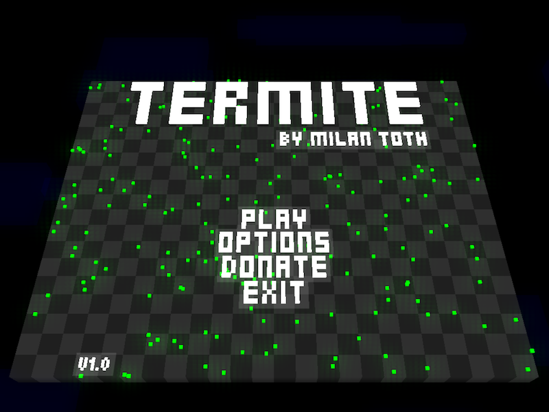

# Termite - The ultimate real-time strategy



Termite is the ultimate psychedelic real-time action strategy experience. You are the leader of a termite hive with three objectives :

- collect food  
- Produce ants  
- Destroy alien colonies  
- Select groups of termits, order them to collect food or attack aliens, use the speed slider to slow down/speed up time to have more control over your ants.  

With Termite you get :

- 31 levels of intense action and mass destruction  
- Random scene generator  
- Tons of particles  
- Voxel system based minimal design

The code is also suitable for learning purposes.

## Try it! ##

[https://github.com/milgra/termite/releases/download/0.8/termite.app.tar.gz]

Extract the archive and call termite.app/termite. It is a standalone application bundle running on all distributions.

## Build ##

```
git clone https://github.com/milgra/termite.git
cd termite
meson build --buildtype=release
ninja -C build
sudo ninja -C build install
```

### Files

ant.c - Ant antity  
control.c - Control layer  
defaults.c - Settings and defaults  
food.c - Food entity  
grid.c - World grid  
grid2d.c - Abstract grid for path finding, etc  
levels.c - Level descriptions  
main.c - SDL handling, top level control  
particle.c - Particle entity for effects  
scene.c - Scene handling
ui.c - UI handling
voxelutil.c - Voxel label generator

### Tech info

Cortex is a pure C project written in [headerless C](https://github.com/milgra/headerlessc).  
It uses reference-counted memory management ( zc_memory.c ).  
It uses modular programming with mediator - implementation groups with different functionality that don't include each other directly, they send messages to each other.  
If a module is "static" a global variable is used to store it's state, instancing is meaningless .  

### User reviews from iOS/Android/Steam stores

“SO ADDICTING AND AMAZING - Just downloaded the game and started playing and became instantly addicted. A very interesting concept! I highly recommend it especially for only .99 cents” 5/5 USA

“I’ve never seen anything like that before. For the price, it’s totally worth it! Love the modern-retro atmosphere.” 5/5 Hungary

“I thoroughly enjoyed the journey through this game and had no qualms with the simplicity of the gameplay, since the difficulty made me push harder and harder each time. Great game, great music (maybe the vocals are a bit much) and overall smooth mechanics that took me for a ride more than once.” 5/5 Denmark

Surgical precision required byOctobop Find out who is the real genius among you: the neuro-surgeons talk the talk, but can they handle the Cortex? Just the right amount of subtle but fast-paced taps are needed to guide your precious thought through the brain. Get too excited and splat. Great competition for your friends: apparently for some people it’s a breeze, and others (like me) crash into walls a lot. :-) I’m getting better though. Can’t let the nerds beat me! Good music! Needs instructions: tap sides of screen to shift dot through the maze.

Beauty true beauty byerrolgarner There is no point using words to explain how great this game is, just play it

Instant, miminalistic, strong flow experience byNavajonki1987greatapp Up front: If you’re looking for a deep plot with characters and the usual game elements this will surprise you. It’s a very simple game, but is incredibly captivating. As you progress through the different levels, you must focus simply on not loosing focus. If you’re into games like Super Hexagon and appreciate minimalistic, finely crafted games, try this out.

### WebAssembly 

find src -type f -name "*.c" > files.txt
emcc -Isrc/termite -Isrc/zc_core -Isrc/zc_math -Isrc/termite/gl -I/home/milgra/Downloads/emsdk/upstream/emscripten/system/includer/emscripten.h -DPATH_MAX=255 -DTERMITE_VERSION=\"1.0\" -sUSE_SDL=2 -sMAX_WEBGL_VERSION=1 $(cat files.txt) -o termite.html

### TODO

- Re-thing renderer

